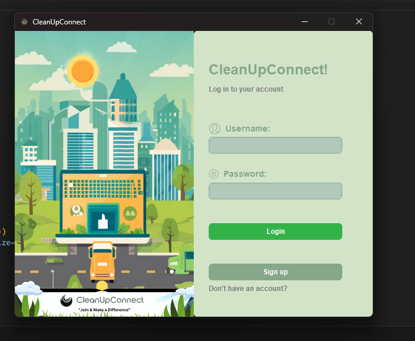
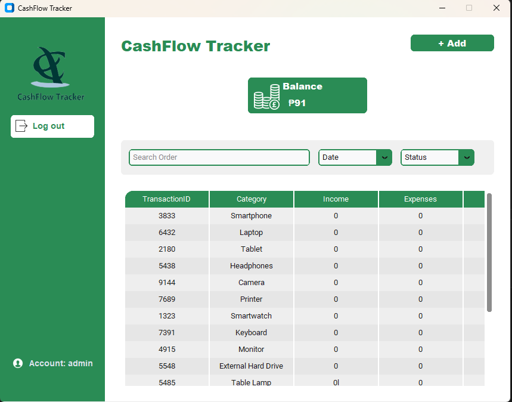
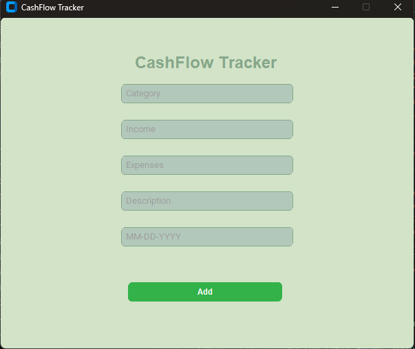

# 💸 CashFlow Tracker System

A modern, desktop-based financial management tool built with Python. This application leverages **CustomTkinter** for a sleek, dark-themed user interface and **MySQL** for secure data persistence. Track your income, expenses, and savings effortlessly, and visualize your financial health through dynamic graphs.

---

## 🖼️ User Interface Showcase

<div align="center">

### Landing & Login

The entry point of the application. Users can log in with their credentials or navigate to the registration page.



---

### User Registration

New users can create an account. The system automatically creates a unique transaction table for every new user.


---

### Dashboard (Home)

View **Total Balance**, **Total Income**, **Total Expenses**, and **Total Savings**. Includes a real-time data table and theme toggles.



---

### Transaction Management

Easily add, categorize, and track your cash flow.



</div>

---

## 🚀 Core Features

* **Secure User Sessions**: Individualized data tracking for every registered user.
* **Full CRUD Functionality**:

  * **Create**: Add new income/expense/savings entries.
  * **Read**: Search for transactions by ID and view a full history table.
  * **Update**: Modify existing transaction details.
  * **Delete**: Remove records instantly.
* **Data Visualization**: Generate Bar or Line Graphs using Matplotlib.
* **Customization**: Integrated Dark Mode and Light Mode support.
* **Admin Panel**: Dedicated interface (Login: `admin` / `cashflow1`) to manage users and maintain system security.

---

## 🛠️ Technology Stack

* **GUI**: CustomTkinter
* **Language**: Python 3.x
* **Database**: MySQL
* **Imaging**: Pillow (PIL)
* **Plotting**: Matplotlib

---

## ⚙️ Setup & Installation

### Database Setup

1. Ensure MySQL is running (XAMPP/WAMP).
2. The database `cashflow` will be created automatically on first launch.

### Dependencies

```bash
pip install customtkinter mysql-connector-python pillow matplotlib
```

### Run the App

```bash
python loginui.py
```

---

## 📂 Project Structure

```
loginui.py         — Main entry point
signupui.py        — User registration
main.py            — Dashboard & transaction logic
admin.py           — Administrative management tools
img/UI/            — Screenshots of the application interface
```

---

Developed for efficient **personal finance tracking** with a modern interface and robust database integration.
